# Site Management System (SiteMS)
Akbank FullStack Bootcamp Graduation Project - Site Management System (SiteMS)

# Table of Contents

1. [Project Explanation](#Project-Explanation)
3. [Used technologies](#Used-technologies:)
4. [Database](#Database)
5. [Backend](#Backend)
6. [Frontend](#Frontend)

## Project Explanation
You are an administrator on a site. You will manage the dues and common use electricity, water and natural gas bills of the apartments on your site through a system.
You have two types of users.

### 1. Admin/ Administrator
- Can enter apartment information.
- Enters resident user information.
- Enters the dues and billing information to be paid per apartment (Monthly). 
- Displays incoming payment information.
- Displays incoming messages.
- It should be understood that the messages are read/unread/new messages.
- Displays monthly debit-credit list.
- Lists, edits, deletes residents.
- Lists and deletes apartment /housing information.

### 2- User (Resident)
- Displays the invoice and dues information assigned to him/her.
- Debt can be only paid by credit card.
- Can send a message to the manager.
- Displays his/her payments.

### In the Apartment/Housing information
- In which block
- Status (Full-empty)
- Type (2+1 etc.)
- Floor location
- Apartment number
- Apartment owner or tenant

### In user information
- Name surname
- TCNo
- E-mail
- Phone
- Vehicle information (plate number, if any)

### When the system is used first
1.	The manager enters the apartment information.
2.	Enters the resident information. A password is automatically generated to log in.
3.	Assigns users to apartments.
4.	Enters monthly dues information.
5.	Enters billing information monthly

Apart from the interface, a separate service will be written for users to pay by credit card. Data for credit card service will be kept in mongodb. The service will be written as .Net WebApi. 
In this service, payment is made by checking the bank information (credit card number, etc.) for each user in the system.
Payment can only be made by credit card.

## Used technologies:
- C#
- ASP .NET CORE Web Api
- ASP .NET CORE MVC
- MSSQL
- MONGO DB
- Code First / Entity FrameWork Core
- Microsoft SQL Server Management Studio
- React.js

## Database
I used 4 tables in SQL database and 1 collection in mongodb. The tables in MS SQL are as follows:

All tables:

  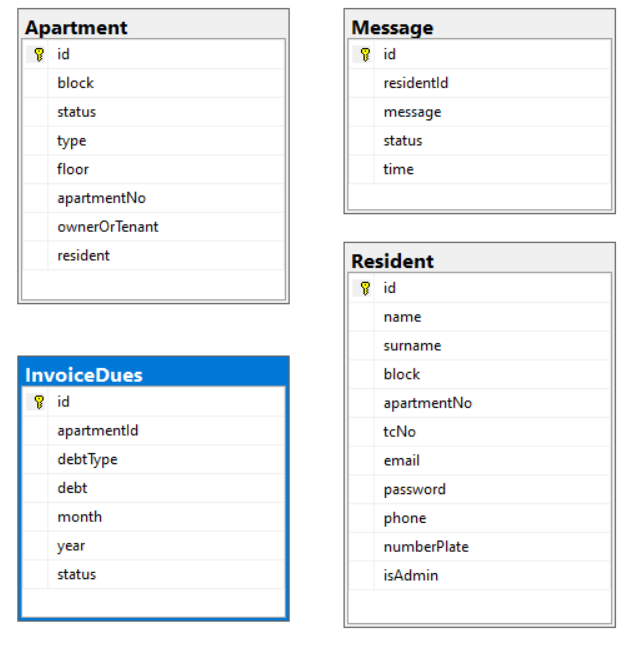

Tables and columns:

  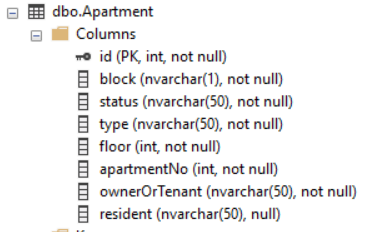
   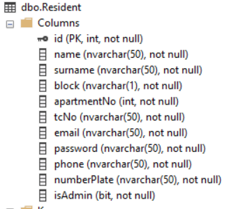
  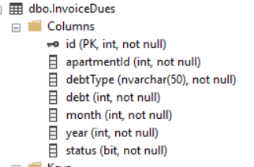
   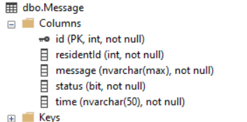

 

The CreditCard collection in mongodb is as follows:  
residentId is related with the id of the ResidentTable.

 

  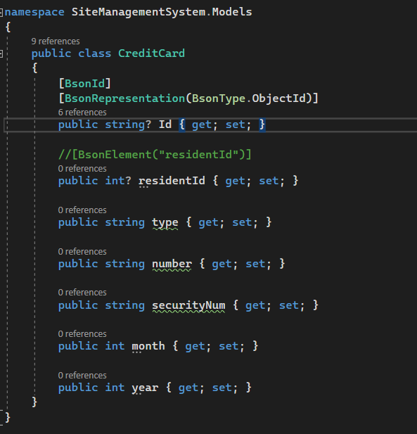

## Backend
Two different webAPI was written. One is for MS SQL database, other is for mongodb. 

### MSSQL Database .NET Web API Project Folders

  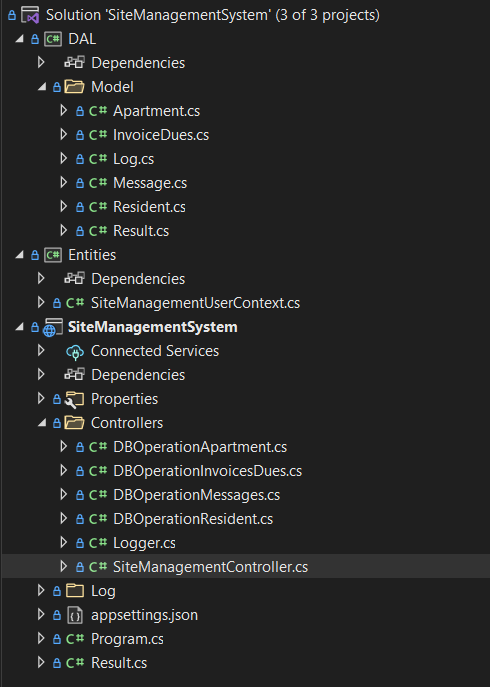

APIs that is used:

  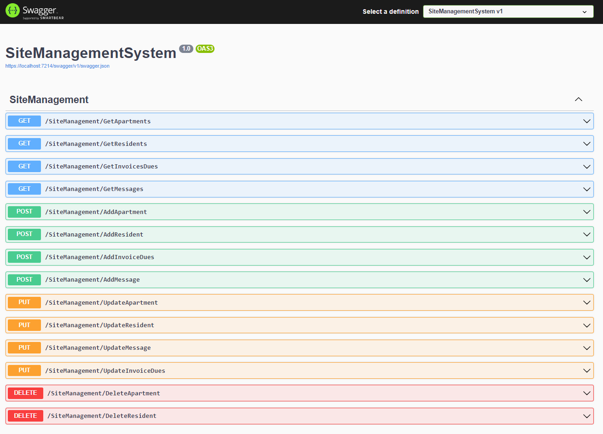

### Mongodb Database .NET Web API Project Folders

  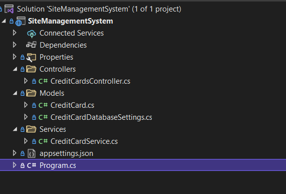

APIs that is used:  
I used 2 APIs: Get Credit Cards and Post

  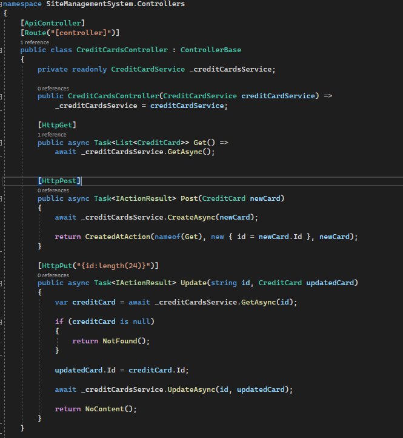

## Frontend
The project folders are as follows:

  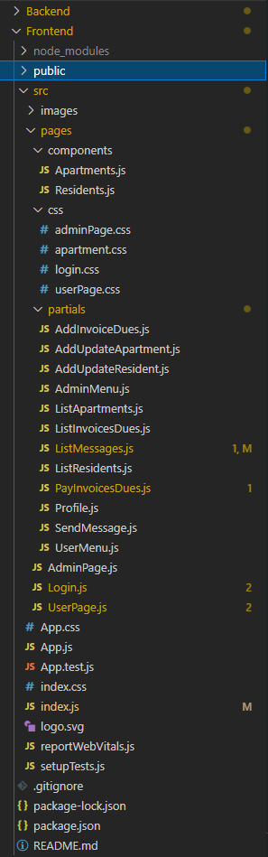

In this project, there are 3 main pages which are Login, AdminPage and UserPage.  
In AdminPage, there are 7 partial pages which are ListApartment, ListResident, ListInvoicesDues, ListMessages, AddUpdateApartment, AddUpdateResidents and AddInvoicesDues.  
In UserPage, there are 5 partial pages which are Profile, ListInvoicesDues, ListMessages, PayInvoicesDues and SendMessages.  

  
## LoginPage

  

## Admin Pages
Partial pages are as follows:

- ListApartment

  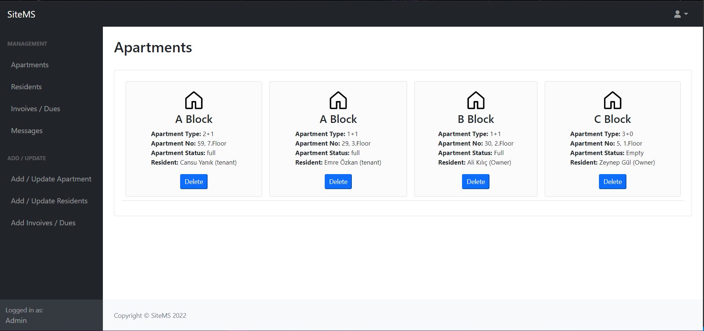

- ListResident

  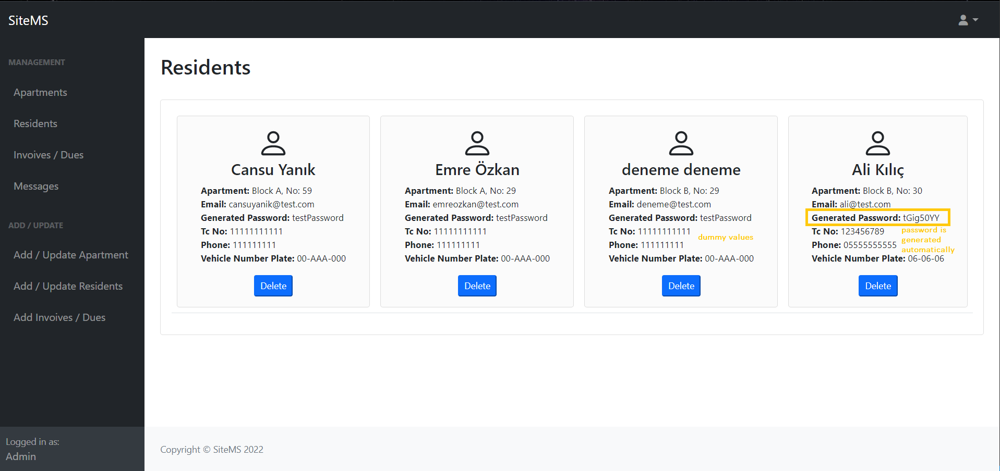

- ListInvoicesDues
You can see the paid/not paid information

  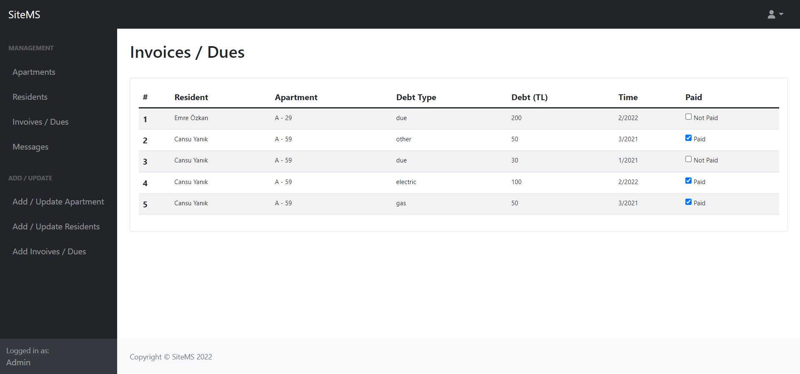

- MessageList
You can see the unread/read information

  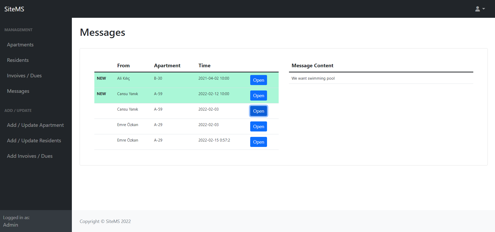

- MessageList after open a new message
Unread message becomes read message

  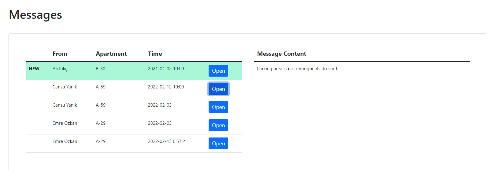

- AddUpdateApartment
New apartment can be added or existing apartment can be updated (according to block and apartment No)

  

- Add an example apartment

  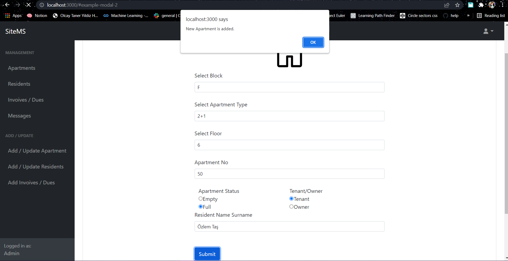

After adding:

  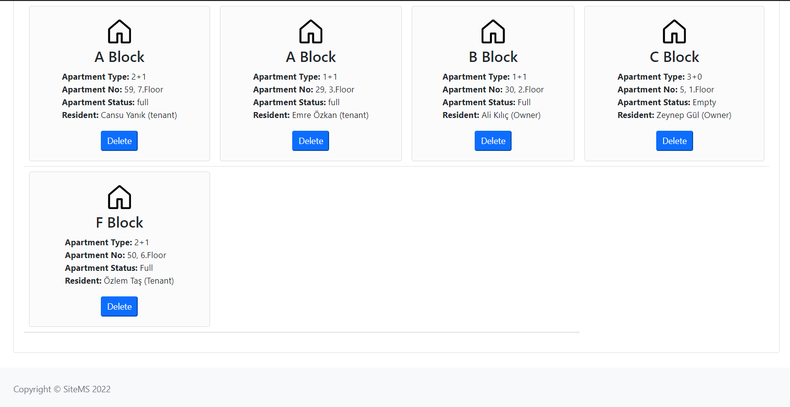

- AddUpdateResident
New resident can be added or existing resident can be updated (according to tcNo)

  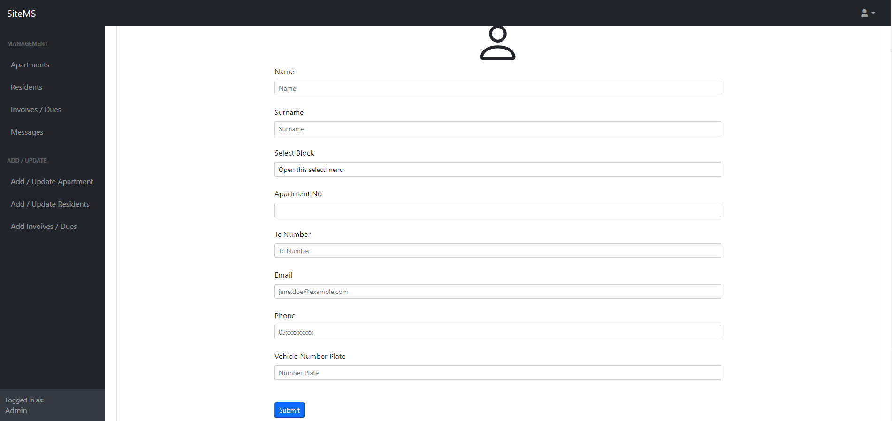

- AddDept
Existing apartments are listed and can be selected.

  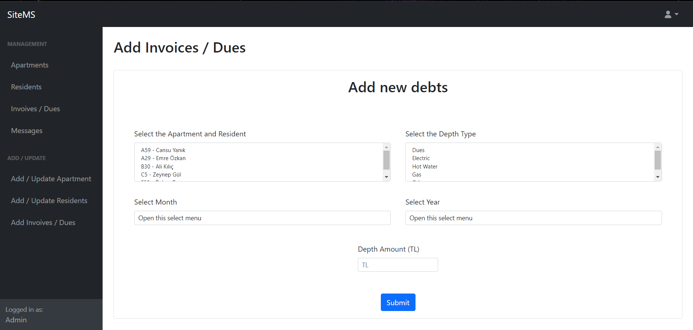

- Delete an existing resident

  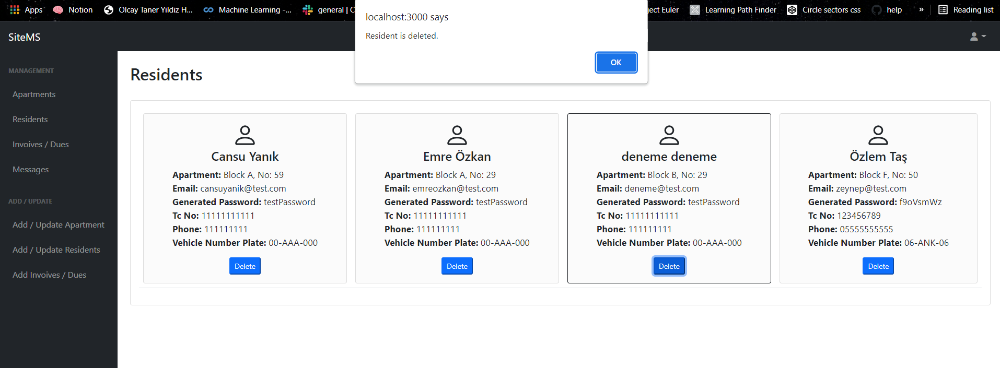

After deletion:

  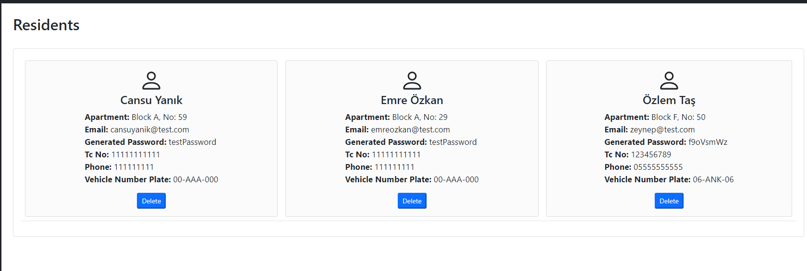

## User Pages
Partial pages are as follows:

- Profile
User profile (values are dummy)

  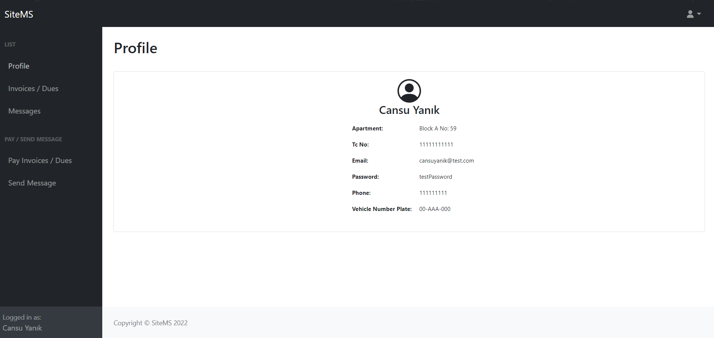

- ListInvoicesDues
User's invoices and dues are filtered and displayed. Paid/not paid information can be seen.

  

- MessageList
User's messages are filtered and displayed.

  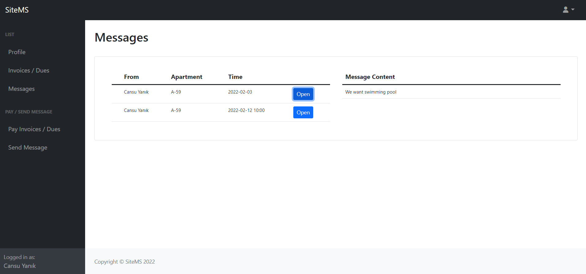

- PayInvoiceDue

User can select the debt which is not paid and user can select a credit card which is saved before. 
Or user can paid debt by adding new credit card.

  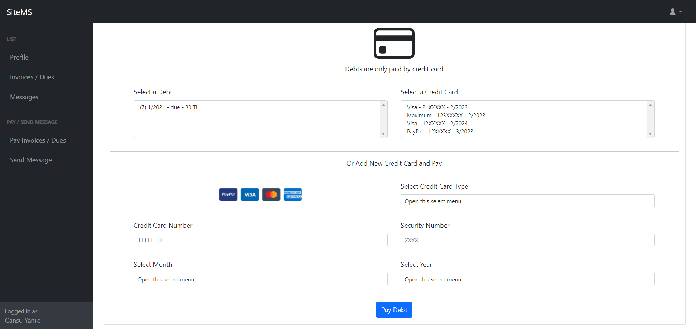

- SendMessage

  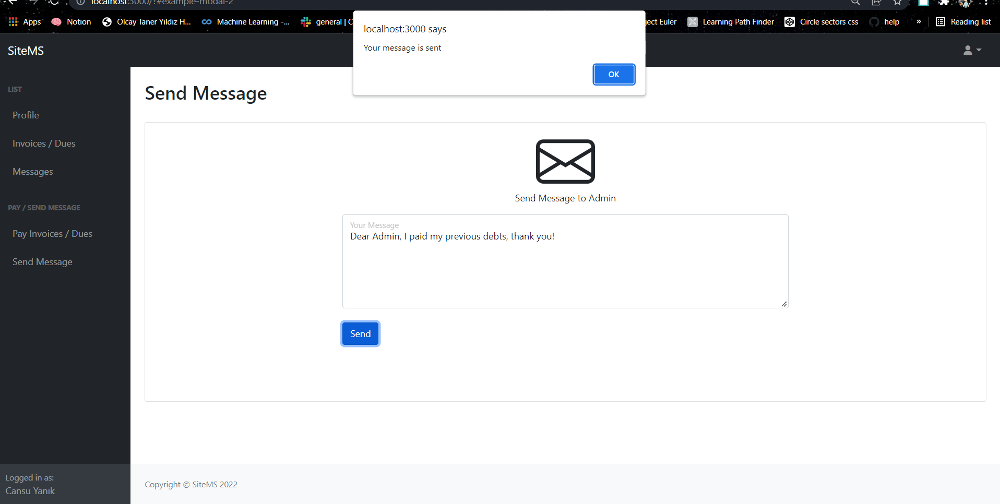

After sending new message:

  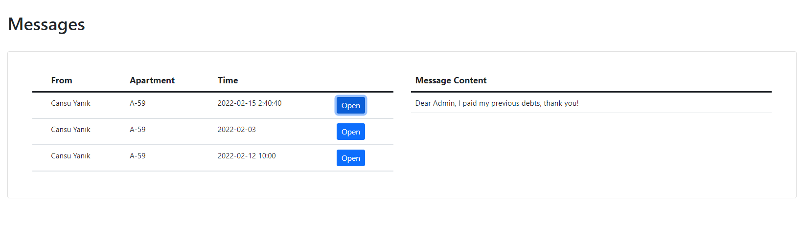

